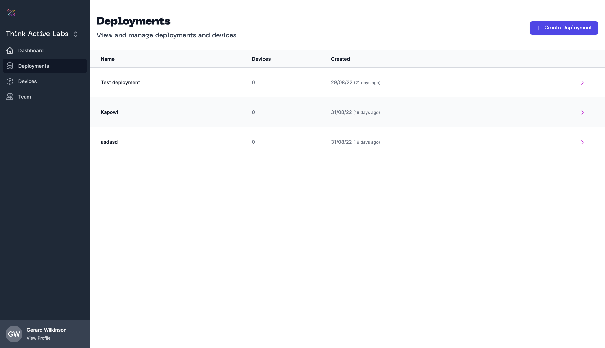

# Deployments

Deployments allow users of ThinkActive Cloud to group devices logically enabling clear and simple tracking of where devices are deployed and data collected.

## Managing Deployments

Deployments can be created in the Deployments section of ThinkActive Cloud. You can create deployments by providing a name. Once created you can assign devices to a deployment by seraching for devices by serial number.