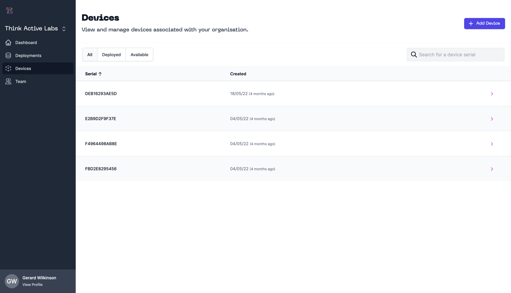
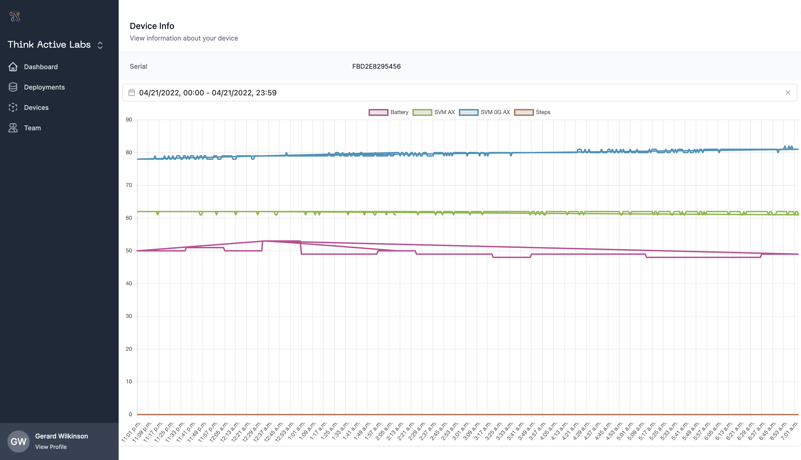

# Devices

The devices view allows you to view all devices registered in your organisation.

## Managing Devices

Devices are registered with ThinkActive Cloud on first use there is no need to manually register them.

:::info
Note that using a device with ThinkActive Cloud registers it with your organisation. This counts towards your device credits.

Once devices are added they cannot be removed from your organisation.
:::

You can search for devices by their serial, sort devices by last synced and more.

## Understanding your Device data

When selecting a device you can see all the information currently recorded about a device. Including last sync time, device serial, device type and more.

In the device data section you can see data from each of the sensors on the device. At the top of this section you can retrieve data by selecting a date range and an aggregate window (daily, hourly, RAW).

When viewing data in aggregate modes you can see several aggregate measures such as standard deviation, min and max values in the aggregate window you have chosen. You can drill down in greater detail by selecting specific days for analysis.

:::info
At present you can only view RAW data on daily views.
:::

Each sensor on the type of device selected shown in its own chart. Each sensor is described under the chart title.

You can also export the data you are currently viewing at any time by clicking "Export CSV". 
