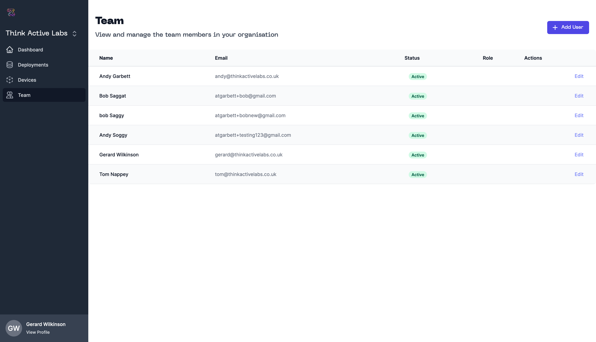

# Organisations

ThinkActive Cloud support your organisation with all your sensor data capture needs. Your Organisation on ThinkActive Cloud allows you to manage your team, devices and deployments from one place.

Coming soon you will be able to view/update your billing and plan information.

:::info
If you are a member of multiple organisations you can swap between them by clicking on your organisation name in the side bar. If a dropdown does not appear then you are not a member of multiple organisations.
:::

## Team

You can manage the members of your organisation from the Team view. Add your users details during account creation and assign them a role.

Roles provide users with permissions to perform actions within your organisation. You can use our pre-defined roles or create your own.