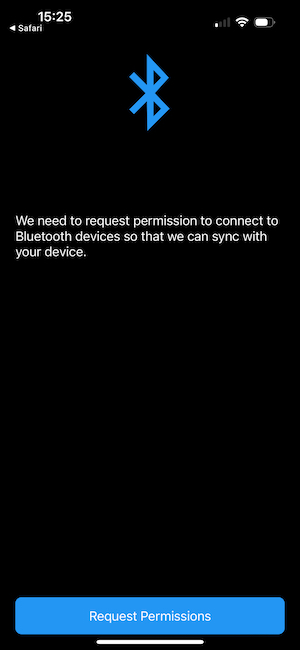
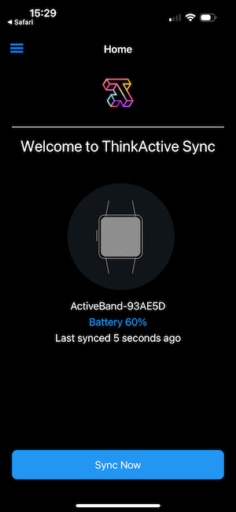
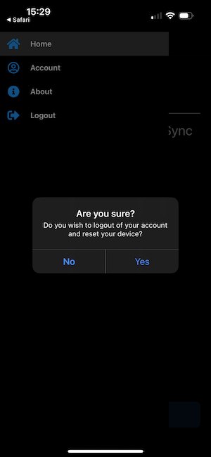

# ThinkActive Sync App

ThinkActive Sync App allows your end users and participants to collect sensor data with their own smartphone. The application has a clear and simple login and device setup walkthrough and a simple interface for all ages and users.

## Using the right app for your team

ThinkActive Sync is a multi-tenant application. Your organisation can have a custom version of this application submitted to the store should you wish. The instructions below are designed for users of ThinkActive Sync. Some of the steps may vary slightly with custom versions of Thinkactive Sync.

## Getting started

### Download Thinkactive Sync

The ThinkActive Sync application is available for iOS/iPadOS and Android. To get started use the download links below to download the app for your device.

- [iOS/iPadOS Store](https://apps.apple.com/us/app/thinkactive-sync/id1579167656)
- [Google Play Store](https://play.google.com/store/apps/details?id=com.thinkactivelabs.activeband_sync_app)

### Logging In

To login to ThinkActive Sync you just need your email address. Tap "Lets get started" to open the login prompt.

:::warning
In order to login to ThinkActive Sync you must have permissions to sync data from one of the organisations you are a member of. Check your role if you cannot sign in.
:::

This will send a login token to your email address. Open your mail client and click the login button on this email to continue.

:::info
If you are a member of multiple organisations you will be asked to select which organisation you would like to login as after clicking through.
:::

### Bluetooth permissions

After completing login you will be taken to the Bluetooth permissions page. You must grant permissions to use Bluetooth to ThinkActive Sync in order to continue. This is neccesary to connect to your sensors and collect data.

:::info
On Android you will also be asked to provide location data. Google consider Bluetooth access as location access on older versions of Android. In order to maintain compatibility with the widest set of devices we prompt for this permission too. We do not collect your location data.
:::

This screen will show again if at any time when using the application you disable Bluetooth or revoke Bluetooth permissions. Follow the instructions on the app to get your permissions setup correctly again.

### Device Scanning and Setup

Once you have granted Bluetooth permissions the device will immeditately begin scanning for devices nearby. This process may take around 10-20 seconds.

If your device cannot be found ensure the device is sufficiently charged and the screen is lit before scanning again.

:::warning
Your application may prompt you to state that it has discovered a device nearby that needs to be updated before use. ThinkActive Sync can prepare OEM devices during the setup process. Refer to your project team for guidance should you need to perform this step.
:::

Once a device has been found tap on it to get it setup. On this screen you can vibrate a device to confirm it is the one you expect to setup and then proceed with setup.

### Home Page

Once setup has been completed you will be left on the home page. This page is where you can interact with your device by syncing data or viewing battery percentage information. You can also see the last time you synced.

### Syncing

The frequency with which you wish to sync your device is entirely under your control. Depending upon the nature of the study or data collection excercise you are working within your device will log data to its internal storage for up to 7 days. We recommend syncing at least once a day to ensure that your device is functioning correctly and data is correctly being collected.

:::warning
Should your device run out of battery it is advised that upon it being recharged you sync with the application at your earliest convenience. This reduces the chance of data loss.
:::

The Sync process on ThinkActive Sync is performed in two steps:

- Data is transferred from your ActiveBand device over Bluetooth to your smartphone or tablet
- Data is then transferred from your smartphone or tablet to ThinkActive Cloud

Should you be in an area where you cannot access the internet for an extended period of time you can safely sync data to your smartphone or tablet and then sync this stored data later to ThinkActive Cloud. This process is all taken care of for you within our application. Once the application informs you that all data has been synced successfully your data will appear within the ThinkActive Cloud portal ready for analysis.

### Logout

You can log out of the application and wipe all data by pressing the menu icon in the top left corner of the screen and pressing sign out.

