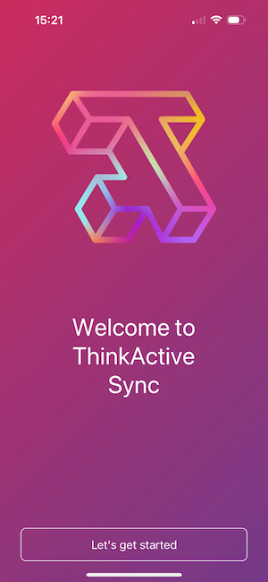
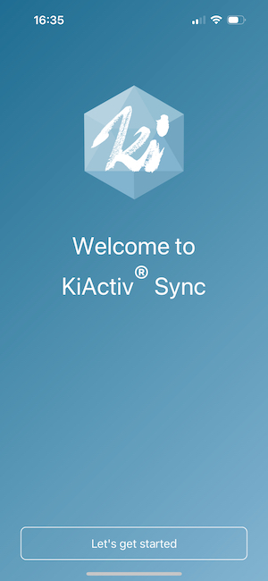

# ThinkActive Sync App

ThinkActive Sync App allows your end users and participants to collect sensor data with their own smartphone. The application has a clear and simple login and device setup walkthrough and a simple interface for all ages and users.

## Using the right app for your team

 

ThinkActive Sync is a multi-tenant application. Your organisation can have a custom version of this application submitted to the store should you wish. The instructions below are designed for users of ThinkActiv Sync. Some of the steps may vary slightly with custom versions of Thinkactive Sync.

## Getting started

### Download Thinkactive Sync

The ThinkActive Sync application is available for iOS/iPadOS and Android. To get started use the download links below to download the app for your device.

- [iOS/iPadOS Store](https://apps.apple.com/us/app/thinkactive-sync/id1579167656)
- [Google Play Store](https://play.google.com/store/apps/details?id=com.thinkactivelabs.activeband_sync_app)

### Logging In

To login to ThinkActive Sync you just need your email address. Tap "Lets get started" to open the login prompt.

:::warning
In order to login to ThinkActive Sync you must have permissions to sync data from one of the organisations you are a member of. Check your role if you cannot sign in.
:::

This will send a login token to your email address. Open your mail client and click the login button on this email to continue.

:::info
If you are a member of multiple organisations you will be asked to select which organisation you would like to login as after clicking through.
:::

### Bluetooth permissions

After completing login you will be taken to the Bluetooth permissions page. You must grant permissions to use Bluetooth to ThinkActive Sync in order to continue.