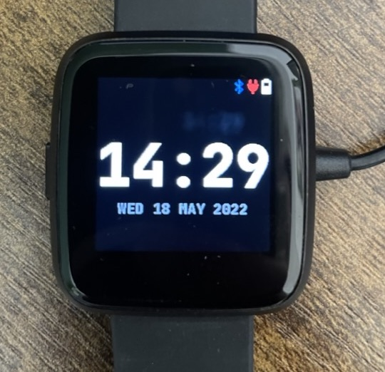
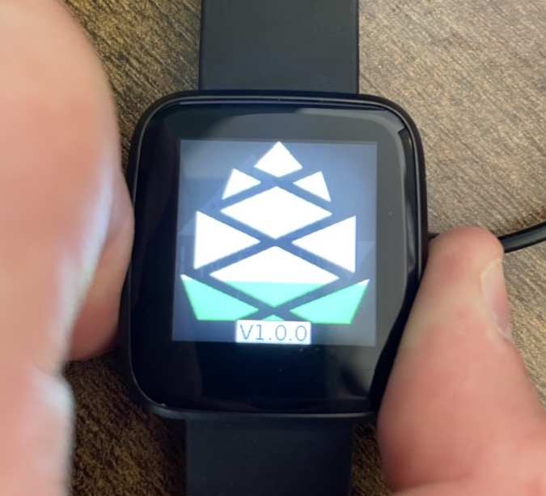
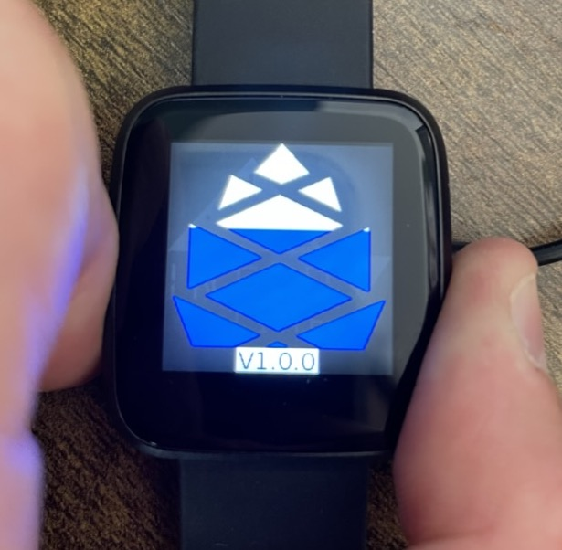
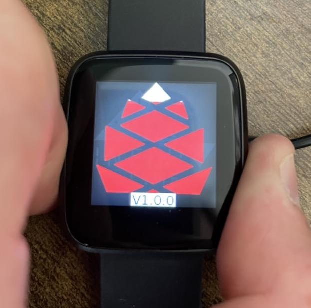
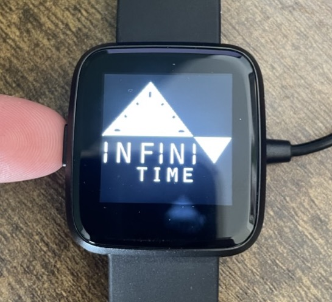

# Device States

Each supported ActiveBand device has a number of different device states. ActiveBand devices in their typical operation mode are what we call **Production Mode**. It may be neccesary to use the steps on this page to put ActiveBand devices into certain modes in order to resolve issues.

:::warning
Execise caution when using device modes other than Production Mode.
Some of the ActiveBand Device States shown here are for debug purposes or for recovery from broken device states. You may brick (make unrecoverable) ActiveBand devices by using these device modes incorrectly.
:::

## InfiniTime

InfiniTime devices have two device states [Production Mode](#production-mode) and [Recovery Mode](#recovery-mode). InfiniTime devices ordered from third-party suppliers such as [Pine64](https://pine64.net)

### Production Mode

Production mode is the typical mode that the device will be in. This is the normal operational mode.

The home screen of the device in this mode will look like this:

The time and date will show as dashes until the device has been synced for the first time. If the device runs out of battery it may also return to not knowing the current time. A sync will restore the time back to the correct values.

#### Icons
- 
 The presence of this icon denotes the ActiveBand is actively connected to a device.
  - Whilst this is showing you will be unable to sync this device any other devices.
- 
 The presence of this icon denotes the ActiveBand is currently being charged.
- 
 This icon shows the current battery level of the device.

#### Navigation
- Pressing the side button will always eventually return to this screen. Depending upon how many screens deep you are in the user interface on the device.
- Swiping from the left side will open the settings drawer.
- Swiping from the top side will open notification drawer.

#### Rebooting the device

When the device is in its charging cradle it can be rebooted.

:::info
Earlier versions of ActiveBand on InfiniTime allowed rebooting of the device whilst off the charging cradle. This was removed in v1.9.0.
:::

##### Rebootable states

When rebooting an InfiniTime device there are 3 options for reboot.

:::danger
Take care using anything other than Standard Device Reboot.
Holding the power button for too long will enter other reboot modes.
In typical use of InfiniTime devices you should not use Previous Firmware Device Reboot or Recovery Mode Device Reboot. These reboot procedures should only be used if a device cannot be recovered through other means.
:::

**Standard Device Reboot (Green Pinecone)**

Pressing and holding the side button until a green pinecone is shown will simply reboot the device in back into the same firmware it was running when restart was initiated.

**Previous Firmware Device Reboot (Blue Pinecone)**

Pressing and holding the side button until a blue pinecone is shown will reboot the device in back into the previous firmware it has on device. If this device has never been flashed before it will return to the same firmware it was on when the restart was initiated.

**Recovery Mode Device Reboot**

Pressing and holding the side button until a red pinecone is shown will reboot the device into recovery mode.

### Recovery Mode

InfiniTime devices have a built in recovery mode for recovering devices from a firmware error. The device will enter this mode itself under a the following circumstances:

- The device has been unable to successfully start its firmware after several attempts
- The device firmware images are corrupt and cannot be loaded
- The device has no firmware images available
- The device has been forced into recovery mode during a reboot

When a device is in recovery mode all ActiveBand services are stopped. This means no data can be logged or synced.

InfiniTime's recovery mode has a few known issues which are important to consider:

- Device is not discoverable after around 5 minutes. Rebooting a device in recovery mode will restore services again

#### Exiting Recovery Mode

In order to get an InfiniTime device to exit recovery mode you must either:

- Reboot the device using a [standard reboot](#rebootable-states). This will only work if the standard device firmware is working/available
- Reflash the device with firmware using the ThinkActive Sync App or ThinkActive Device Manager

**Using the ThinkActive Sync App**

1. If the device is already logged in logout to reflash a device
2. We recommend quitting the application entirely at this point
    - On iOS this is a double press of the home button or a swipe up and hold from the home bar. Then swipe away the ThinkActive Sync app
    - On Android typically it is the left most button on the navigation bar which will open a list of all apps. Swipe away ThinkActive Sync app
    - If the user cannot complete this reboot of the phone or coming back to the app later should cause the app to have restarted
3. Begin the device setup – the app should discover the device and prompt the user with a message saying this device needs updating before it can be used
    - Once this is initiated inform the user that they must keep the phone and the watch near to each other until the update completes
    - Update times are very dependent upon the device. For example my iPhone updates the device in around 3 minutes but my older Android device can take up to 10 minutes
4. Once the update is complete the app will rescan for the devices.
    - You may find that the app is saying it cannot find the device or it consistently finds the device with a serial number of "0". We suggest following the steps in step 2 and reboot the app or the phone. Then begin the setup process. Ensure that the Bluetooth icon has disappeared from the device before starting.
5. Setup should complete successfully.

**Using the ThinkActive Device Manager**

Coming soon...